**PATH PLANNING**
=================

**FERNÁNDEZ HERNÁNDEZ, ALBERTO. DNI: 54003003S**

**Ejercicio 1**
---------------

En primer lugar, vamos a familiarizarnos con el simulador R2P2. Para ello,
ejecutamos el comando python r2p2.py. El resultado de ejecución es un escenario
de un robot que podemos controlar con las flechas del teclado:

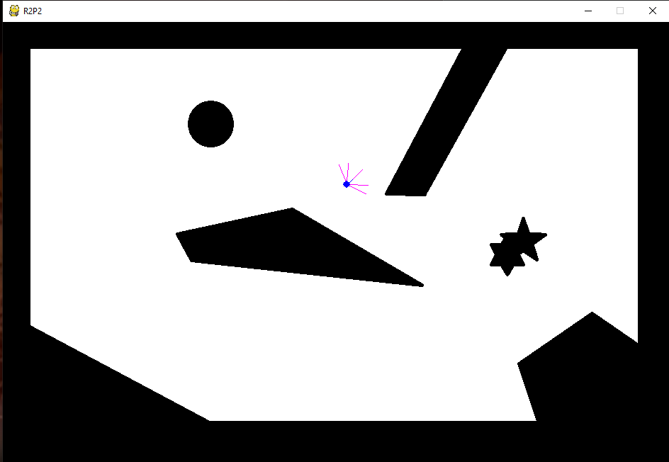

Ilustración . r2p2.py

**Ejercicio 2**
---------------

No obstante, *r2p2* permite obtener también una ruta entre dos puntos dado un
mapa. Para ello debemos ejecutar el siguiente comando:

python r2p2.py --scenario ../conf/scenario-pathplanning.json

El fichero *scenario-pathplanning.json* contiene varios parámetros para el
cálculo de la ruta, tal y como se muestra a continuación:

{

"stage": "../res/test_2.png",

"robot": "../conf/robot.json",

"controller": "../conf/controller-pathplanning.json",

"gui": true

}

-   *stage*: escenario del robot

-   *robot*: características del robot (dimensiones, velocidad máxima, batería,
    rango de valores del sónar, radio etc.)

-   *controller*: controlador utilizado por el robot

-   *gui*: si se emplea o no interfaz gráfica

Desde el controlador podemos modificar varios parámetros, entre los que destaca:

-   *grid_size*: tamaño de la cuadrícula

-   *algorithm*: algoritmo usado para el cálculo de la ruta

-   *heuristic*: heurística empleada

-   *start*: posición de inicio

-   *goal*: posición final u objetivo

Por defecto, el tamaño de la cuadrícula está establecido a 30, utilizando el
algoritmo A\* mediante una heurística simple (*naive*), con coste 1; con la
posición inicial en (18,19) y la meta en (12,12):

{

"class": "pid_controller.path_planning_controller",

"grid_size": 30,

"waypoints": [[40, 40], [310, 300], [290, 300],

[195, 200], [200, 100],[375, 407],

[344, 348], [285, 112], [58, 216],

[105, 341], [186, 314], [170, 410],

[46, 410], [167, 340], [296, 257],

[173, 350], [117, 101], [65, 136],

[77, 296], [129, 344], [163, 345],

[296, 362], [291, 259], [90, 85],

[132, 305], [91, 308]],

"algorithm": "A\*",

"heuristic": "naive",

"start": [18, 19],

"goal": [12, 12]

}

Si lo ejecutamos, obtenemos la siguiente ruta:

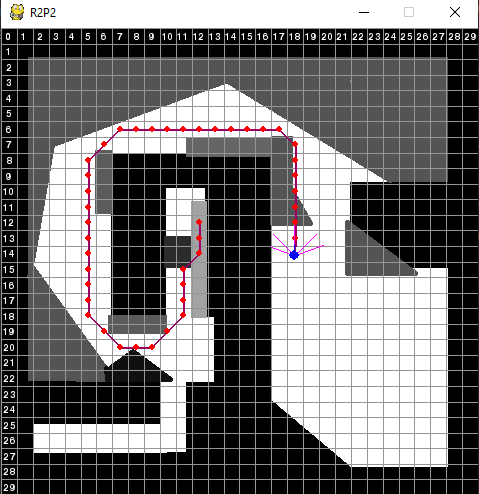

Ilustración . Ruta calculada

**Ejercicio 3**
---------------

Una vez que hayamos visto la ejecución del cálculo de rutas, vamos a realizar
una pequeña modificación en el fichero *controller-pathplanning.json*, cambiando
la posición de inicio y la meta a (27,19) y (8,20), respectivamente:

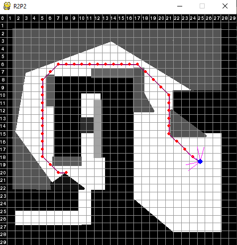

Ilustración . Ruta calculada con nuevas coordenadas

Por otro lado, podemos cambiar también el tamaño de la cuadrícula, por ejemplo
si lo aumentamos a 40:

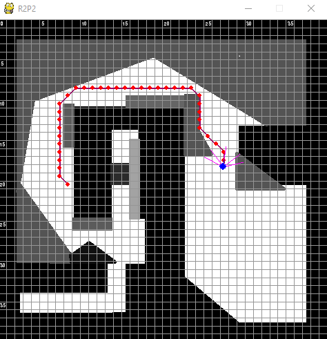

Ilustración . Ruta calculada con la cuadrícula a 40

**Ejercicio 4 y 5**
-------------------

A continuación, vamos a implementar el algoritmo Theta\*. Para ello, nos tenemos
que fijar en el siguiente pseudocódigo:

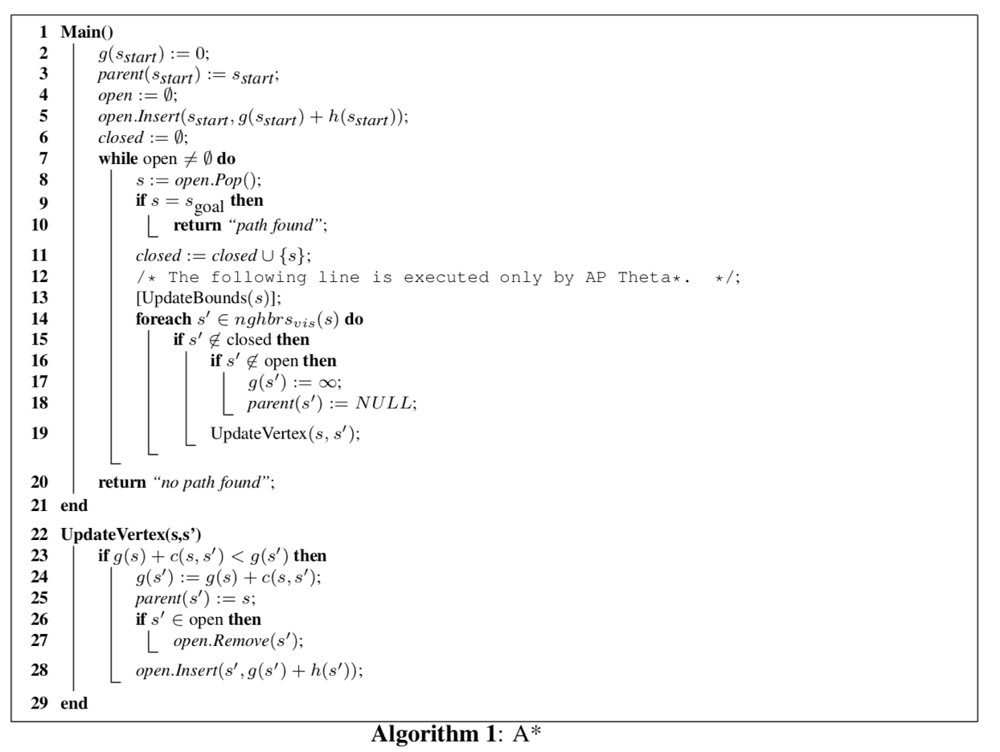

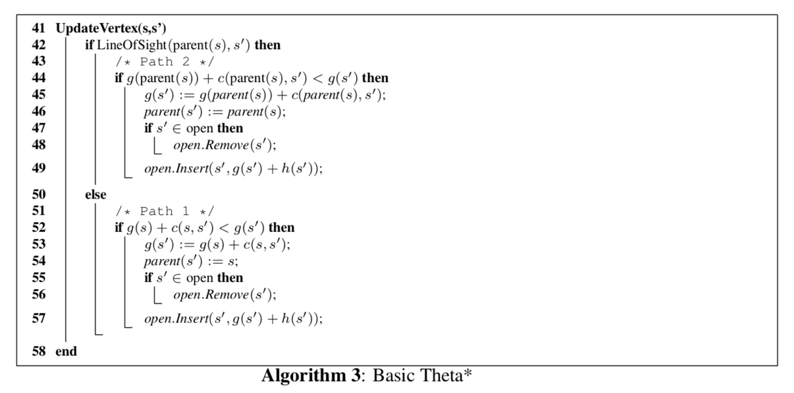

Si nos fijamos en las imágenes anteriores, vemos que la función *UpdateVertex*
en Theta\* es similar al algoritmo A\*, salvo por un detalle: en Theta\*, **el
padre de un nodo no tiene porqué ser el vecino de dicho nodo siempre y cuando
exista una línea de visión entre ambos nodos**. Por tanto, debemos contemplar
las dos situaciones:

-   Si existe una línea de visión

-   En caso contrario (idéntico a la actualización del vértice en A\*)

Si nos vamos al código, si el nodo vecino generado pertenece al conjunto de
abiertos, aplicamos esta función:
```
#Theta* implementation
            if node in openset:
                #If node in parent line of sight
                if lineOfSight(current.parent, node, grid):
                    new_g = current.parent.G + current.parent.move_cost(node)
                    if node.G > new_g:
                        node.G = new_g
                        node.parent = current.parent
                #Otherwise
                else:
                    #Check if we beat the G score 
                    new_g = current.G + current.move_cost(node)
                    if node.G > new_g:
                        #If so, update the node to have a new parent
                        node.G = new_g
                        node.parent = current
```
Por el contrario, si el nodo no se encuentra en la lista de abiertos:
```
            else:
                line_of_sight = lineOfSight(current.parent, node, grid)

                #If current.parent/current at node line of sight
                if line_of_sight:    
                    node.G = current.parent.G + current.parent.move_cost(node)
                    node.parent = current.parent
                else:
                    #If it isn't in the open set, calculate the G and H score for the node
                    node.G = current.G + current.move_cost(node)
                    #Set the parent to our current item
                    node.parent = current

```
Finalmente, actualizamos la heurística y añadimos el nodo al conjunto de
abiertos:
```
                node.H = pp.heuristic[heur](node, goal)
                #Add it to the set
                openset.add(node)
```
Por último, nos queda implementar la línea de visión, tal y como figura en el
pseudocódigo:

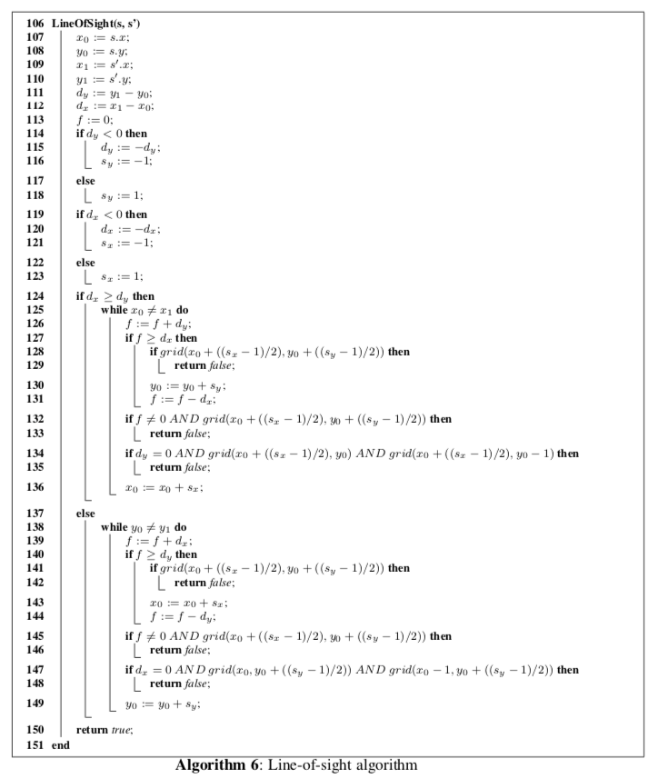

Debido a que existen obstáculos a lo largo del mapa, al robot no le va a quedar
más remedio en muchas ocasiones que esquivarlos. Esto supone que el camino no va
a ser en línea recta, por lo que el robot deberá saber en todo momento si puede
ir o no a un punto en función de si lo puede ver, o dicho de otra manera, **si
está en su línea de visión**.

¿En qué consiste la función *grid*? Esta función consistirá en comprobar dos
detalles:

-   **En primer lugar, que las coordenadas x e y pasadas como parámetro no se
    salgan de la cuadrícula**

-   **En segundo lugar, que el valor de la baldosa sea 1, es decir, blanco.** De
    esta forma lo que estamos haciendo es priorizar las casillas en blanco,
    minimizando el coste.

En el código de *GitHub*, la función se denomina *blocked*:
```
#Check if:
#1. Node X,Y coordinates is at grid
#2. Node value is white (node.value equals 1) or not
def blocked(x,y,grid):
    try:
        node = grid[int(x)][int(y)]
        if node.value == 1:
            return False
        else:
            return True
    except IndexError:
        return True
```
Un detalle que debemos tener en cuenta es el siguiente: a la hora de calcular la
línea de visión de un nodo, vamos a necesitar tanto dicho nodo como su propio
padre. El problema se produce con el primer nodo al comienzo del algoritmo, dado
que al ser el primero no tiene ningún padre asociado. Para solucionar este
problema, al comienzo de la búsqueda debemos indicar que el nodo padre del
priemer nodo es él mismo:
```
#Parent's start is start
start.parent = start
```
Sin embargo, cuando encontramos el nodo objetivo tenemos un bucle *while* que va
añadiendo cada nodo al camino. Sin embargo, como hemos dicho que el primer nodo
tiene como padre él mismo, se producirá un bucle infinito. Por tanto, en este
caso debemos eliminar el nodo padre al que hemos asignado anteriormente:
```
if current == goal:
    #To avoid loops in case we reach goal node
    start.parent = None
    path = []

    while current.parent:
        path.append(current)
        current = current.parent
        path.append(current)

    return path[::-1]
```
Una vez implementado y registrado el algoritmo, lo ejecutamos:

*Start = {18,19}*

*Goal = {12,12}*

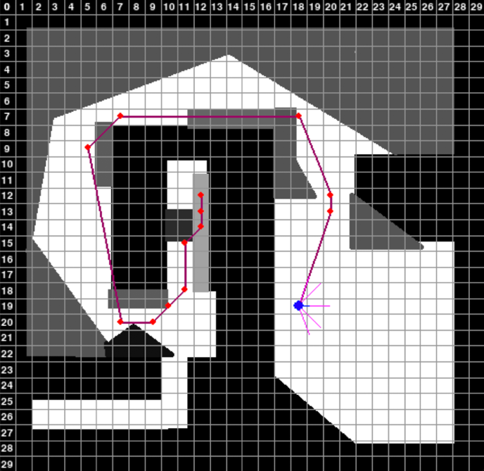

Ilustración 5. Theta\* (I)

*Start = {27,19}*

*Goal = {8,20}*

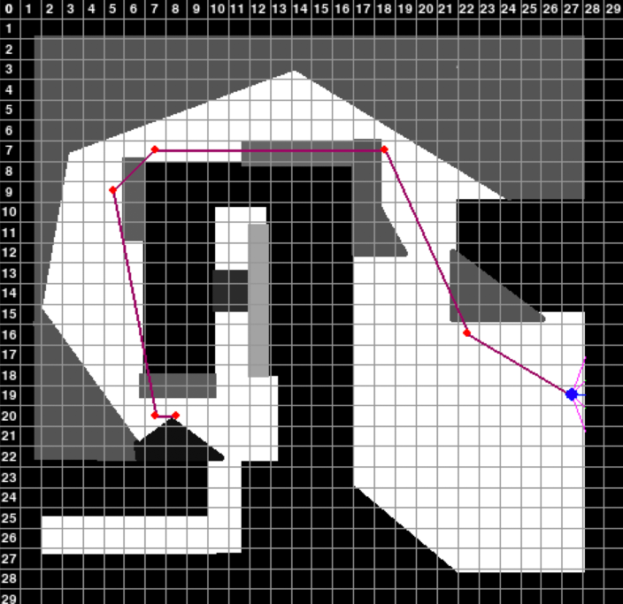

Ilustración 6. Theta\* (II)

**Ejercicio 6. ¿Qué heurística se usa por defecto?**
----------------------------------------------------

Por defecto, se utiliza una heurística sencilla, de valor 1 (*naive*):
```
def naive(point, point2):
    """
    Function that performs a naive heuristic.
    """
    return 1
```
**Ejercicio 7. Implementa las heurísticas euclídea, manhattan y octil para A\*/Theta\***
----------------------------------------------------------------------------------------

**Distancia euclídea**

$$ \mathbf{d}\left( \mathbf{P}_{\mathbf{1}}\mathbf{,}\mathbf{P}_{\mathbf{2}} \right)\mathbf{= \sqrt{\left( \mathbf{x}_{\mathbf{2}}\mathbf{-}\mathbf{x}_{\mathbf{1}} \right)^{\mathbf{2}}\mathb {+}\left( \mathbf{y}_{\mathbf{2}}\mathbf{-}\mathbf{y}_{\mathbf{1}} \right)^{\mathbf{2}}} $$

```
def euclidean(point, point2):
    """
    Function that performs euclidean heuristic.

    """
    "square root of the sum of squares of the differences between two X,Y
    coordinates"

    return sqrt((point2.grid_point[0] - point.grid_point[0])**2 +
    (point2.grid_point[1] - point.grid_point[1])**2)
```
**Distancia Manhattan**

$$
\mathbf{d}\left( \mathbf{P}_{\mathbf{1}}\mathbf{,}\mathbf{P}_{\mathbf{2}} \right)\mathbf{=}\left| \mathbf{x}_{\mathbf{2}}\mathbf{-}\mathbf{x}_{\mathbf{1}} \right|\mathbf{+}\left| \mathbf{y}_{\mathbf{2}}\mathbf{-}\mathbf{y}_{\mathbf{1}} \right|
$$

```
def manhattan(point,point2):

    """
    Function that performs Manhattan heuristic.

    """
    "absolute of the sum of the differences between two X,Y coordinates"
    return abs(point.grid_point[0] - point2.grid_point[0]) + abs(point.grid_point[1]
    - point2.grid_point[1])
```
**Distancia octil**

$$
\mathbf{dx = \ }\left| \mathbf{x}_{\mathbf{2}}\mathbf{-}\mathbf{x}_{\mathbf{1}} \right|
$$

$$
\mathbf{dy = \ }\left| \mathbf{y}_{\mathbf{2}}\mathbf{-}\mathbf{y}_{\mathbf{1}} \right|
$$

$$
\mathbf{d}\left( \mathbf{P}_{\mathbf{1}}\mathbf{,}\mathbf{P}_{\mathbf{2}} \right)\mathbf{= \ }\left| \mathbf{dx - dy} \right|\mathbf{+ \ }\sqrt{\mathbf{2}}\mathbf{*min(dx,dy)}
$$
```
def octile(point, point2):
    """
    Function that performs octile heuristic.
    """
    """
    dx = abs(node.x - goal.x)
    dy = abs(node.y - goal.y)
    return abs(dx - dy) + sqrt(2) \* min(dx, dy)

    get the diagonal distance between two nodes

    source: http://theory.stanford.edu/\~amitp/GameProgramming/Heuristics.html
    """
    dx = abs(point.grid_point[0] - point2.grid_point[0])
    dy = abs(point.grid_point[1] - point2.grid_point[1])

    return abs(dx - dy) + sqrt(2) \* min(dx, dy)
```
Una vez implementadas y registradas todas las heurísticas, realicemos una
comparación entre las diferentes heurísticas con A\* y Theta\*, utilizando los
siguientes valores:

*Start = {27,19}*

*Goal = {8,20}*

**A\***

|           | Longitud del camino | Coste total de la ruta | Nodos expandidos |
|-----------|---------------------|------------------------|------------------|
| naive     | 41                  | 41                     | 383              |
| euclídea  | 41                  | 41                     | 291              |
| manhattan | 40                  | 45                     | 234              |
| octil     | 41                  | 41                     | 271              |

**Theta\***

|           | Longitud del camino | Coste total de la ruta | Nodos expandidos |
|-----------|---------------------|------------------------|------------------|
| naive     | 7                   | 7                      | 383              |
| euclídea  | 7                   | 7                      | 259              |
| manhattan | 11                  | 25                     | 217              |
| octil     | 8                   | 13                     | 251              |

Como podemos comprobar, el coste del cálculo de rutas utilizando el algoritmo
Theta\* es significativamente menor con respecto al algoritmo A\*. Esto se debe
a que, a diferencia de A\*, los giros en el camino no están limitados a 45º, lo
que le permite un mayor grado de movimiento y con ello un movimiento mucho más
realista. Pese a que este cálculo ralentiza el cálculo de la ruta, el camino es
mucho más corto y suave en cuanto a los giros.

**Ejercicio 8. Crea la imagen de la diapositiva 23, establece el tamaño de la cuadrícula a 40, ejecuta los 3 algoritmos y compara los resultados, cambiando la heurística. Captura las imágenes con las soluciones y súbelas con el resto de los archivos**
-----------------------------------------------------------------------------------------------------------------------------------------------------------------------------------------------------------------------------------------------------------

Para este ejercicio, utilizaremos la siguiente plantilla, a la que llamaremos
*test_PECL3.png*:

Utilizaremos, por otro lado, los siguientes parámetros:

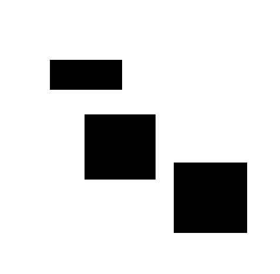

*Start {0,0}*

*Goal {39, 39}*

**Dijkstra**

|           | Longitud del camino | Coste total de la ruta | Nodos expandidos |
|-----------|---------------------|------------------------|------------------|
| naive     | 53                  | 53                     | 1269             |
| euclídea  | 53                  | 53                     | 1269             |
| manhattan | 53                  | 53                     | 1269             |
| octil     | 53                  | 53                     | 1269             |


Ilustración 7. Dijkstra

Dado de *Dijkstra* no trabaja con heurísticas, el número de nodos expandidos es
el mismo.

**A\***

|           | Longitud del camino | Coste total de la ruta | Nodos expandidos |
|-----------|---------------------|------------------------|------------------|
| naive     | 53                  | 53                     | 1269             |
| euclídea  | 53                  | 53                     | 659              |
| manhattan | 53                  | 53                     | 53               |
| octil     | 53                  | 53                     | 377              |

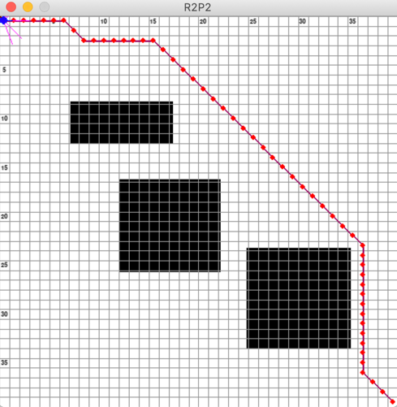

Ilustración 8. naive

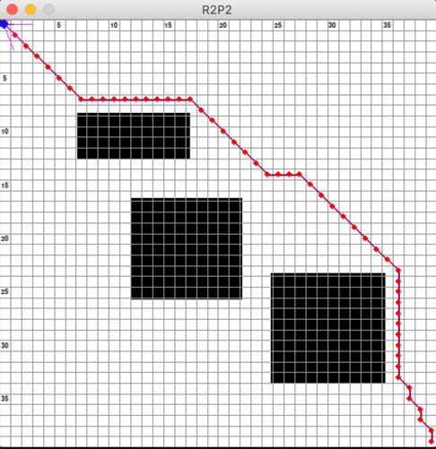

Ilustración 9. Euclidea


Ilustración 10. Manhattan

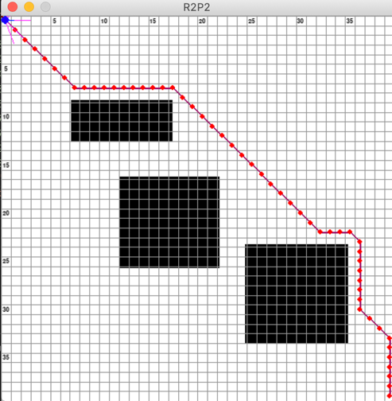

Ilustración 11. Octil

**Theta\***

|           | Longitud del camino | Coste total de la ruta | Nodos expandidos |
|-----------|---------------------|------------------------|------------------|
| naive     | 4                   | 4                      | 1269             |
| euclídea  | 4                   | 4                      | 494              |
| manhattan | 4                   | 4                      | 53               |
| octil     | 4                   | 4                      | 341              |


Ilustración 12. naive

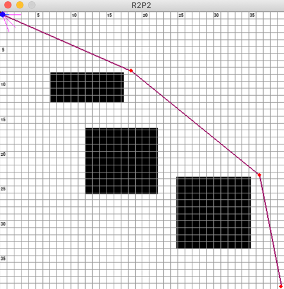

Ilustración 13. Euclidea


Ilustración 14. Manhattan


Ilustración 15. Octil

Por tanto, podemos sacar las siguientes conclusiones:

-   Si comparamos *Dijkstra* con *A\** vemos que con este último obtenemos
    mejores resultados. Esto se debe a que *A\** es una versión generalizada del
    algoritmo de *Dijkstra* (si la *h = 0*, *A\* = Dijkstra*). Dado que trabaja
    con valores heurísticos, encuentra la solución óptima pero, sobretodo,
    trabaja mucho mejor que *Dijkstra* cuando el problema crece en complejidad.

-   Por otro lado, el número de nodos expandidos en *Theta\** es
    significativamente menor que en *A\** en la mayoría de las heurísticas. Esto
    se debe a que, gracias a la integración de la comprobación de la **línea de
    visión**, no queda restringido a giros de 45 grados entre los nodos, lo cual
    supone caminos mucho más realistas que en *A\** (en este último, para
    obtener un ruta con giros más suaves se requería de un post-procesamiento
    tras el cálculo de ruta, lo que se traducía en mayor tiempo)

En conclusión, **el uso de heurísticas en la búsqueda mediante algoritmos como
A\* o Theta\* reduce significativamente el espacio de búsqueda**. Además, pese a
que *Theta\** sea un algoritmo mucho más lento que *A\** (ya que necesita
calcular la línea de visión), obtiene mejores resultados (ruta de menor coste y
más optima).

-   Si nos vamos con las heurísticas, por lo general la distancia de Manhattan
    obtiene mejores resultados que la distancia Euclídea, y en general, a mayor
    tamaño de la cuadrícula (y por ello mayor complejidad) la heurística de
    Manhattan es más preferible. Esto se debe a que la heurística Euclídea mide
    la distancia en línea recta entre dos puntos, lo cual es mucho menos
    realista que la distancia de Manhattan, sobretodo si hay obstáculos como en
    este caso. En cuanto a la distancia octil, vemos que bastante más alto que
    la distancia de Manhattan, aunque relativamente más bajo que la distancia
    Euclídea. Esto se debe a que la distancia octil es una variante de la
    distancia de Chebyshev:

$$
\max\left( \left| x_{1} - x_{2} \right|,\ \left| y_{1} - y_{2} \right| \right)
$$

Mientras que la distancia de Manhattan es:

$$
\left| x_{1} - x_{2} \right| + \ \left| y_{1} - y_{2} \right|
$$

Como vemos, la diferencia reside en que la primera heurística es el máximo de la
diferencia entre cada una de las coordenadas, mientras que la distancia de
Manhattan es la suma. En conclusión, el orden de las heurísticas (ordenadas de
mejor a peor en cuanto al número de nodos expandidos) es el siguiente:

*Manhattan < Octile < Heuristic < Naive*

**Las capturas de las rutas anteriores se encuentran en la carpeta Capturas
Ej8.**

**Integration**
===============

Una vez que tenemos listos los algoritmos de *Path-planning*, vamos a
utilizarlos sobre un plan generado en PDDL para generar el cálculo de rutas
entre las diferentes acciones.

**Ejercicio 1**
---------------

Lo primero que vamos a realizar es **modificar el fichero del problema de
Cooperation**, de modo que una coordenada del estilo X = 06 e Y = 10 tenga el
siguiente formato:

*P0610*

Además, vamos a eliminar obstáculos en el camino, por lo que crearemos un
escenario completamente en blanco, sin ningún obstáculo, al que llamaremos
*sandbox_white.png*.

**Ejercicio 2**
---------------

Una vez creado el mapa y modificado el problema, **ejecutamos el planificador
PDDL con el nuevo problema**, obteniendo el siguiente plan:

; Plan found with metric 80.010

; Theoretical reachable cost 80.010

; States evaluated so far: 75

; States pruned based on pre-heuristic cost lower bound: 0

; Time 0.72

; Dummy steps: 1

0.000: (change-navigation-mode follower0 n0 n1) [1.000]

0.000: (recharge-battery leader) [1.800]

0.001: (undock follower0) [1.000]

1.002: (move follower0 p1002 p1210 n1) [2.000]

1.801: (undock leader) [1.000]

2.802: (move leader p0610 p0509 n0) [0.500]

3.003: (move follower0 p1210 p1613 n1) [1.250]

3.303: (change-tilt-orientation leader t_0 t_270) [1.000]

4.254: (change-tilt-orientation follower0 t_0 t_315) [1.000]

4.304: (change-pan-orientation leader p_0 p_225) [1.000]

5.255: (change-pan-orientation follower0 p_0 p_90) [1.000]

5.305: (take-photo leader p0509 p_225 t_270) [1.000]

6.256: (take-photo follower0 p1613 p_90 t_315) [1.000]

7.257: (send-photo follower0 p1613 p_90 t_315) [1.000]

8.258: (move follower0 p1613 p0610 n1) [2.500]

10.759: (move follower0 p0610 p0509 n1) [0.250]

11.010: (send-photo follower0 p0509 p_225 t_270) [1.000]

Una vez creado, los guardamos en un fichero *txt* llamado *planning.txt* situado
en la carpeta *res* de *r2p2*.

**Ejercicio 3**
---------------

A continuación, vamos a echar un vistazo al fichero *pddl_executor.py*. Este
archivo permite leer el plan del planificador PDDL y cada vez que encuentre una
acción *move* con una coordenada, llamará al algoritmo de planificación de rutas
con la coordenada de destino de la acción. Por ejemplo, si la acción *move* es
como la siguiente:

*move P0217 P0129*

Llamará al planificador para dirigirse al punto *P0129*.

**Ejercicio 4**
---------------

Si nos fijamos en el fichero *pddl_executor.py*, vemos que la clase
*PDDL_Executor* tiene un método llamado *\__calculate_path*, dentro del cual
llama a la función *run_path_planning*. Sin embargo, ¿Cuáles son los valores por
defecto tanto de heurística como del propio algoritmo? Si nos vamos a la función
*run_path_planning* situada en el fichero *path_planing.py*, vemos que por
defecto el algoritmo utilizado es *A\** y la heurística es *naive*. Por tanto,
para modificar estos parámetros basta con añadir como parámetros *heur* y *algo*
en la llamada a *run_path_planning* en *\__calculate_path*:
```
   def __calculate_path(self, dst):
        step = 40
        shape = u.npdata.shape
        step_x = shape[0]/step
        step_y = shape[1]/step
        self.goal = pp.run_path_planning(step,
        start=(int(self.robot.x/step_x), in(self.robot.y/step_y)),
                                         finish=(int(dst[0]), int(dst[1])),
                                         show_grid=True, algo = Theta\*, heur =
manhattan)
```
**Ejercicio 5**
---------------

A continuación, vamos a ejecutar el algoritmo de cálculo de rutas a partir del
fichero PDDL generado en el ejercicio 2. Además, vamos a realizar una
comparativa entre los diferentes algoritmos y heurísticas tal y como hicimos en
el apartado de *path planning*. En primer lugar, debemos dirigirnos al fichero
*scenario-pathplanning.json*:

{

"stage": "../res/sandbox_white.png",

"robot": "../conf/robot.json",

"controller": "../conf/controller-pathplanning.json",

"gui": true

}

Una vez en el fichero, debemos modificar el campo *controller*, ya que está
llamando al fichero de configuración *controller-pathplanning*, es decir, al del
robot. Por ello, debemos poner en su lugar el fichero
*controller-planning.json*, pues es el que llama a la clase *PDDL_Executor*
junto con el fichero con el plan:

{

"class": "pddl_executor.PDDL_Executor",

"plan_path": "../res/planning.txt"

}

Una vez modificado el fichero *scenario-pathplanning.json*, vamos a realizar una
comparativa entre los diferentes algoritmos. En primer lugar, si ejecutamos el
siguiente comando:

```
python r2p2.py --scenario ../conf/scenario-pathplanning.json
```
En primer lugar, *r2p2* extrae inicialmente de *planning.txt* las acciones
*unload* y *move*. De esta última se obtienen las coordenadas de destino:

TASKS:

['undock', ('move', (12, 10)), 'undock', ('move', (5, 9)), ('move', (16, 13)),
('move', (6, 10)), ('move', (5, 9))]

Por cada movimiento entre las coordenadas, el algoritmo obtiene la ruta entre
los dos puntos, así como los costes, la longitud de la ruta y el número de nodos
expandidos:

```
Planned path: [(251, 208), (239, 208), (227, 208), (215, 196), (204, 184), (192,
172), (180, 160), (169, 149), (157, 137), (145, 125)]

Path length: 10

Total path cost: 10

Total nodes expanded: 398

\>\> Battery level: 100/100`
```

A continuación, vamos a realizar la comparación mediante los diferentes
algoritmos y heurísticas:

**Dijkstra**

|                    | *move P1210* | *move P0509* | *move P1613* | *move P0610* | *move P0509* |
|--------------------|--------------|--------------|--------------|--------------|--------------|
| *Longitud ruta*    | 10           | 8            | 12           | 10           | 2            |
| *Coste total*      | 10           | 8            | 12           | 10           | 2            |
| *Nodos expandidos* | 398          | 568          | 896          | 1190         | 1196         |

**A\* (naive)**

|                    | *move P1210* | *move P0509* | *move P1613* | *move P0610* | *move P0509* |
|--------------------|--------------|--------------|--------------|--------------|--------------|
| *Longitud ruta*    | 10           | 8            | 12           | 10           | 2            |
| *Coste total*      | 10           | 8            | 12           | 10           | 2            |
| *Nodos expandidos* | 404          | 574          | 902          | 1197         | 1206         |

**A\* (euclídea)**

|                    | *move P1210* | *move P0509* | *move P1613* | *move P0610* | *move P0509* |
|--------------------|--------------|--------------|--------------|--------------|--------------|
| *Longitud ruta*    | 10           | 8            | 12           | 10           | 2            |
| *Coste total*      | 10           | 8            | 12           | 10           | 2            |
| *Nodos expandidos* | 25           | 36           | 69           | 92           | 94           |

**A\* (manhattan)**

|                    | *move P1210* | *move P0509* | *move P1613* | *move P0610* | *move P0509* |
|--------------------|--------------|--------------|--------------|--------------|--------------|
| *Longitud ruta*    | 10           | 8            | 12           | 10           | 2            |
| *Coste total*      | 10           | 8            | 12           | 10           | 2            |
| *Nodos expandidos* | 10           | 18           | 30           | 40           | 42           |

**A\* (octil)**

|                    | *move P1210* | *move P0509* | *move P1613* | *move P0610* | *move P0509* |
|--------------------|--------------|--------------|--------------|--------------|--------------|
| *Longitud ruta*    | 10           | 8            | 12           | 10           | 2            |
| *Coste total*      | 10           | 8            | 12           | 10           | 2            |
| *Nodos expandidos* | 20           | 35           | 60           | 70           | 72           |

**Theta\* (naive)**

|                    | *move P1210* | *move P0509* | *move P1613* | *move P0610* | *move P0509* |
|--------------------|--------------|--------------|--------------|--------------|--------------|
| *Longitud ruta*    | 2            | 2            | 2            | 2            | 2            |
| *Coste total*      | 2            | 2            | 2            | 2            | 2            |
| *Nodos expandidos* | 418          | 593          | 912          | 1202         | 1219         |

**Theta\* (euclídea)**

|                    | *move P1210* | *move P0509* | *move P1613* | *move P0610* | *move P0509* |
|--------------------|--------------|--------------|--------------|--------------|--------------|
| *Longitud ruta*    | 2            | 2            | 2            | 2            | 2            |
| *Coste total*      | 2            | 2            | 2            | 2            | 2            |
| *Nodos expandidos* | 10           | 18           | 32           | 42           | 45           |

**Theta\* (manhattan)**

|                    | *move P1210* | *move P0509* | *move P1613* | *move P0610* | *move P0509* |
|--------------------|--------------|--------------|--------------|--------------|--------------|
| *Longitud ruta*    | 2            | 2            | 2            | 2            | 2            |
| *Coste total*      | 2            | 2            | 2            | 2            | 2            |
| *Nodos expandidos* | 10           | 18           | 30           | 40           | 42           |

**Theta\* (octil)**

|                    | *move P1210* | *move P0509* | *move P1613* | *move P0610* | *move P0509* |
|--------------------|--------------|--------------|--------------|--------------|--------------|
| *Longitud ruta*    | 2            | 2            | 2            | 2            | 2            |
| *Coste total*      | 2            | 2            | 2            | 2            | 2            |
| *Nodos expandidos* | 10           | 18           | 30           | 40           | 43           |

Comenzamos comparando los algoritmos de *Dijkstra*, *A\** y *Theta\** con
heurística *naive*. Si nos fijamos en el número de nodos expandidos, podemos
comprobar como *Dijkstra* expande un menor número de nodos si lo comparamos con
los otros dos algoritmos. Esto se debe a que la heúristica empleada tanto por
*A\** como por *Theta\** son muy simple, por lo que lo más probable es que se
trate de una **heurística no admisible**. Como consecuencia, el número de nodos
expandidos será mayor en los algoritmos *A\** y *Theta\**. Por otra parte, si
nos fijamos en el coste total, vemos que *Theta\** siempre vale 2 al realizar el
movimiento de un punto a otro, ya que al poder comprobar la línea de visión y al
no haber obstáculos entre los puntos, el coste de moverse es el más pequeño
(punto1 + punto2 = 2).

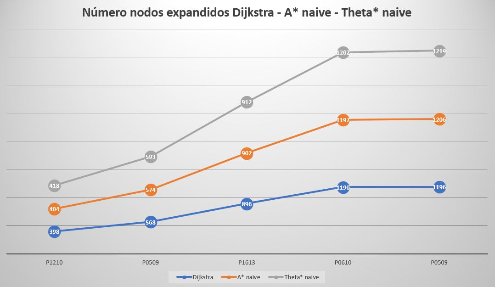

Por otro lado, si comparamos los algoritmos *A\** y *Theta\** con cada una de
las heurísticas, al igual que el robot, tanto *Theta\** como *A\** obtienen
mejores resultados con la distancia de *Manhattan*

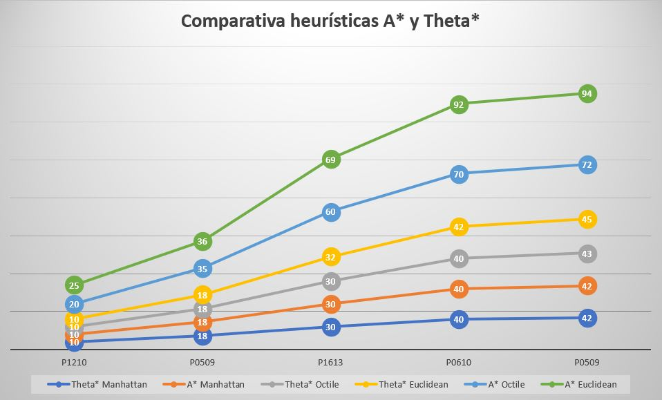

**Conclusiones**
================

Una vez visto el comportamiento del sistema, es momento de reflexionar acerca de
su estructura y, en especial, **si podríamos considerarla suficiente para un
control autónomo del robot**. Para responder a esta pregunta vamos a suponer
varios escenarios:

-   La arquitectura planteada para este sistema incluye dos componentes: por un
    lado, una **capa deliberativa (planificador)** cuyo objetivo es elaborar un
    conjunto de acciones o tareas a desarrollar, dado un estado inicial y una
    meta. Por otro lado, una **capa ejecutiva** cuya misión es la de ejecutar el
    plan generado, que se traducirá en una serie de acciones mecánicas para
    nuestro robot (*girar a la izquierda*, *ir al punto (2,2), ir recto*). Sin
    embargo, no estamos teniendo en cuenta algo muy importante: el entorno sobre
    el que nos movemos es un entorno **no determinista** y, como consecuencia,
    **dinámico**.

**No determinista**: Esto supone que los resultados de una acción dependerán de
cada instante (no será siempre el mismo). Si por ejemplo el robot se sitúa sobre
un terreno llano y pavimentado, el resultado de la acción *acelerar* no será el
mismo que si el robot se mueve por unas dunas.

**Dinámico**: dado que nuestro escenario cambia con el tiempo, el controlador no
solo necesitará el plan a ejecutar, sino que además deberá saber en qué estado
se encuentra en cada momento el sistema para tomar la acción adecuada. Por
ejemplo, dado que no es lo mismo que un vehículo se mueva a 100 km/h en un día
soleado que si hubiera niebla, el controlador necesitará ser consciente de esas
observaciones del entorno para la toma de decisiones.

-   Por otro lado, esta arquitectura no es realista. Esto se debe a que no
    existe un intercalado entre el planificador y el controlador, lo que supone
    que el estado sobre el que ejecutamos el plan es diferente al mundo real.
    Por ello, muchos de los detalles del entorno se omiten y la planificación
    puede acabar fallando.

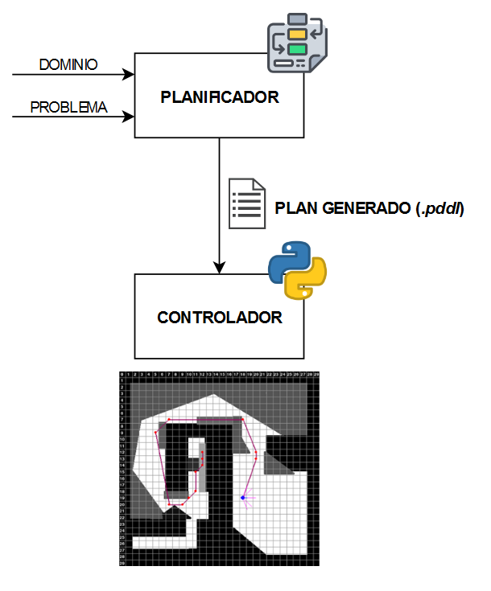

Ilustración 16. Arquitectura actual

Por ello, la solución a proponer consiste en una **arquitectura dinámica, de
tres capas** como se indica a continuación:

-   **Sistema**: dado que estamos ante un entorno dinámico, esta parte de la
    arquitectura no sólo se encargará de la ejecución de las acciones a bajo
    nivel, sino además **conocer el estado/entorno del mundo real**, a través de
    observaciones (sensores). Esta información se enviará al controlador con el
    fin de que este pueda tomar la acción adecuada. Dado que el mundo que nos
    rodea no es completamente observable, por lo que más que una certeza de
    saber en qué estado se encuentra sería más bien un **estado de creencia**.

-   **Controlador**: desde este nivel, juntando tanto el plan generado por el
    planificador como las observaciones enviadas desde el sistema podremos tomar
    una decisión adecuada en un sistema no determinista. En caso de las
    observaciones difieran de los resultados esperados, es necesario una
    revisión del plan, que consiste en coger el plan existente y bien
    modificarlo o bien crear uno nuevo desde el planificador, pasando un estado
    de ejecución hacia atrás. De este modo y a diferencia del esquema anterior,
    existe una comunicación **bidireccional** entre el controlador y el
    planificador, lo que permite adaptar el plan a las observaciones realizadas
    (**replanificación**). Por tanto, gracias a esta arquitectura se permite un
    *feedback* continuo entre el controlador y el planificador, mientras que en
    el diagrama anterior esto no sucedía, ya que el entorno en el que se
    ejecutaba el controlador y el planificador eran distintos.

-   **Planificador**: al igual que en la arquitectura anterior, se encargará de
    generar la secuencia de acciones a realizar para el controlador, con la
    adición de tener que volver a planificar en caso de que el controlador no
    obtenga los resultados esperados.

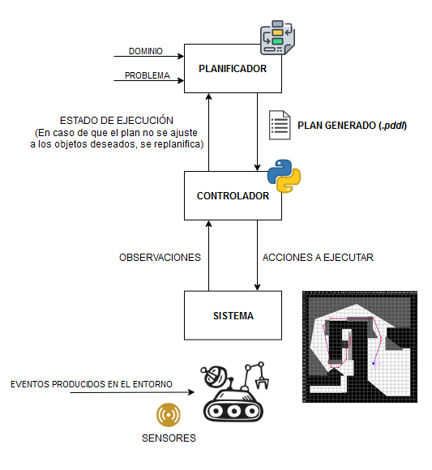

Ilustración 17. Arquitectura de tres capas

Finalmente, añadir que el planificador, junto con la arquitectura mencionada,
puede apoyarse de **técnicas de aprendizaje automático** (*Machine Learning*),
permitiendo la elaboración de modelos a partir de un entrenamiento de los datos
suministrados por el robot. Esto nos permitiría trabajar en mejor medida con
entornos parcialmente observables, ya que no solo basa en un planificador
elaborado a partir de un conjunto de reglas escritas, sino también en la
información del entorno que le rodea, siendo de apoyo a futuras decisiones en el
robot (aumentando su rendimiento).
